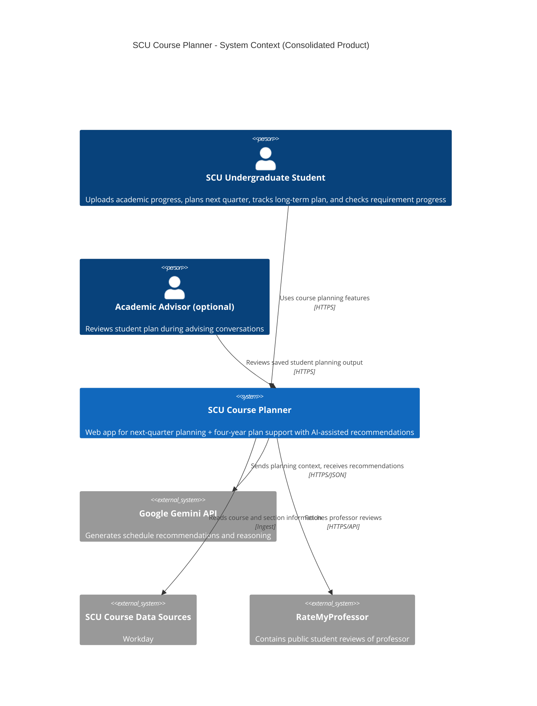
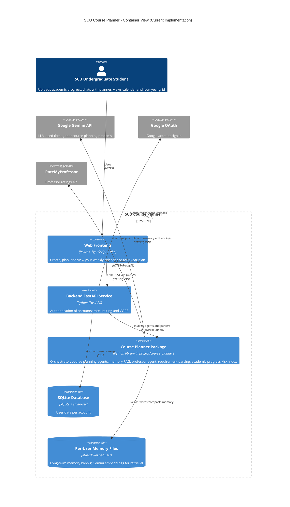

# SCU Course Planner - C4 Architecture Retrospective

This document contains the revised C4 diagrams for the product.

## Product Vision

FOR

SCU Undergraduate Students 

WHO

need help with course planning

THE

SCU Course Planner is a web based course planner

THAT

uses your transcript and course ratings to suggest the optimal course to take

UNLIKE

Workday, SCU Schedule, or your advisor

OUR PRODUCT

Automates course planning and eliminates the need to work around an academic advisor’s schedule

POWERED BY

LLM Comprehension + Webapp front end

---

Our product vision has not changed since we first created it.

## Week 4 C4 Context Diagram and Container Diagram
Our orignal Week 4 Context Diagram and Container Diagram can be found here: [architecture.md](architecture.md)

## Current C4 Context Diagram

## Current C4 Container Diagram

## Decisions That Changed

### Context Diagram
We removed the "Major Requirement Website URL" from the Context Diagram because we found out that major requirements can be included with a student's completed classes using the "Export Academic Progress" feature. This allows us to take 1 single input from the SCU Undergraduate Student to cover both their completed and remaining classes.

We added "Uploads academic progress" to "SCU Undergraduate Student" to reflect the previously mentioned change.

We added "RateMyProfessor" based on the integration we have since included in our project.

### Container Diagram

We added the "Google OAuth," which we use as our sign in API. This is part of the decision to move from managing and storing local accounts locally, to using Google accounts. We made this decision because, given the scope of our project, we trust their security more than a rushed, custom implementation.

We added "Per User Memory Files" because this similarly was a technical feature we did not foresee in our original architecture plan.

We removed the "SCU Undergraduate Bulletin" because, as we discussed above in the Container Diagram section, we found a better solution that we were not aware of during Week 4. 

We removed "Requirements and Course Ingestion" because the design changes mentioned above removed the need for us to focus on finding and parsing courses. Instead, reading from a single spreadsheet is simple enough that we can include it within the backend.

## Tech Debt

Prudent, Deliberate: We are running the live app as two separate Render services, which makes hosting more complicated to set up and maintain.
Reckless, Deliberate: Much of the documentation, such as the README is out of date from the current implementation. We are aware this will need to be cleaned up the code to make it easier to understand by someone else.
Prudent, Inadvertent: We quickly developed the front end to make it functional, but this had the side effect of lacking good design. Now, as we go back and begin revising we see how we need to make the same functiaonltiy look and feel better for users.
Prudent + Inadvertant: We used a # link work around to host multiple separate pages on Render because it worked separately than how front end files were layed out on our local machines for testing. If we were to refine the project further, we would want to design our code base around our hosting infastructure and vice versa.

## What we would do differently in another sprint
If we were to do another sprint, we would work on front-end optimizations to make the user experience better, and we would also work on general backend optimizations and clean ups to make sure it runs as smoothly as possible.
