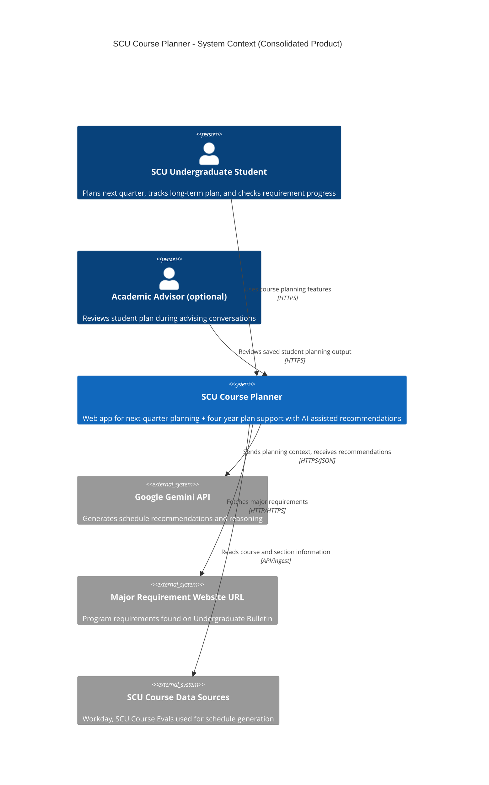
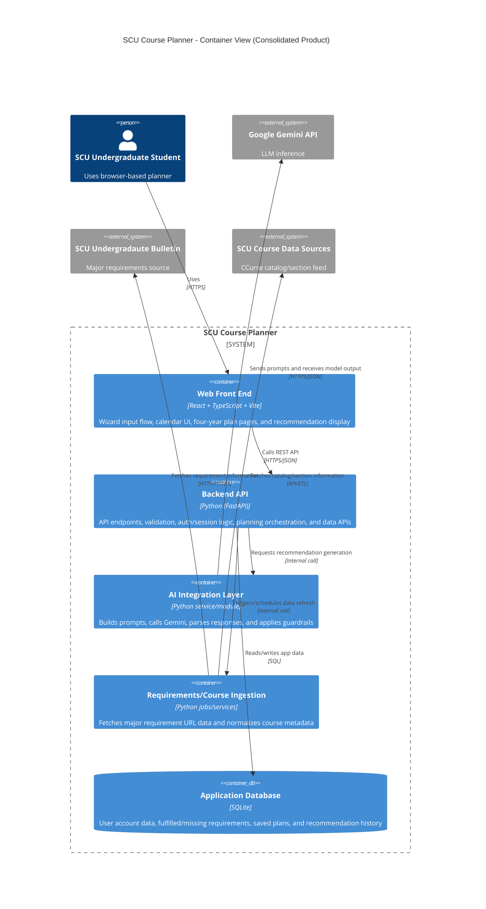

# SCU Course Planner - C4 Architecture

This document contains the C4 diagrams for the consolidated product as the team moves from separate prototypes to one shared codebase.

## Consolidation Direction and Rationale

- **Foundation:** Start from Ismael's prototype because it currently has the strongest UI baseline.
- **Keep from Jason:** Wizard-style guided input flow, but reduce heavy free-response to one focused free-text section.
- **Keep from Ismael:** Next-quarter planning UI patterns and calendar integration.
- **Keep from Joey:** Four-year plan integration and persistence so students can return later.
- **Keep from Jiasheng:** Major requirement website URL ingestion/fetching to enrich planning context.
- **Leave behind:** Prototype-specific UIs that were confusing or too dense, and workflows that require excessive typing.

## Design Iteration Notes (AI-assisted)

- We rejected "frontend calls Gemini directly" because it would expose API keys and weaken controls.
- We chose a Python backend service boundary for AI orchestration so prompts, model settings, and safety checks are centralized.
- We discussed storing full transcript documents, but decided to store only derived requirement status and planning artifacts where possible to reduce privacy risk.
- We selected SQLite for the consolidated phase to keep setup simple while the team converges on one codebase.
- We kept clear container boundaries so each owner has a distinct implementation area and fewer merge conflicts.

## C4 Context Diagram

## C4 Container Diagram

## Ownership Mapping to Containers

- **Ismael (Front End):** `Web Front End`
- **Joey (Database + Backend integration):** `Application Database` and backend-to-database integration paths
- **Jiasheng (Backend security/accounts):** backend account/auth/session components in `Backend API`
- **Jason (AI + remaining backend):** `AI Integration Layer` and remaining backend orchestration in `Backend API`

