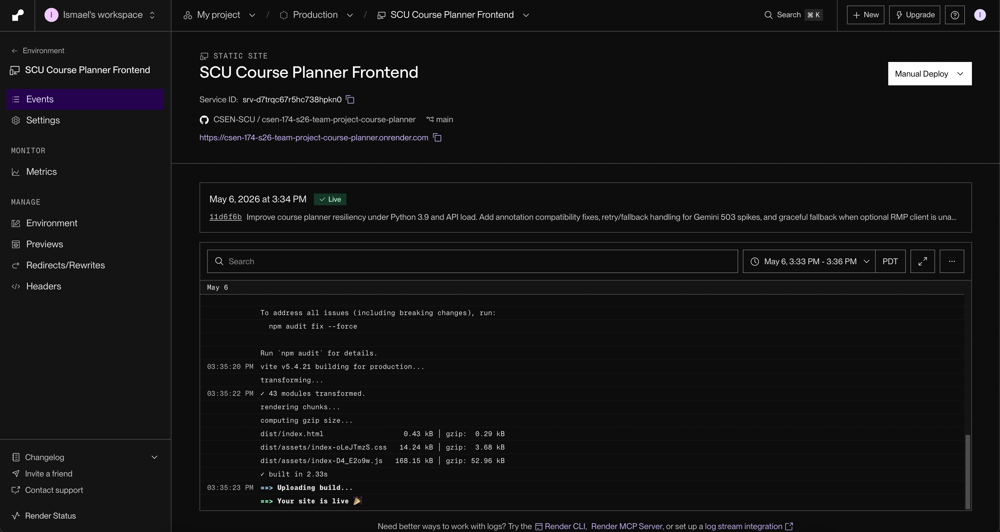
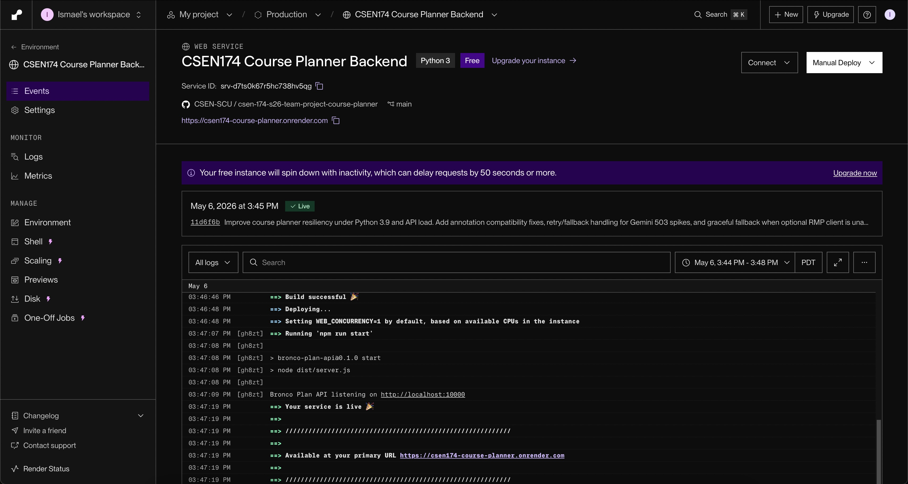

# Sprint 1 — CI/CD and live deployment (Week 6)

---

## Part 1: GitHub Actions CI

### Merged PR with passing CI

- **PR link:**
https://github.com/CSEN-SCU/csen-174-s26-team-project-course-planner/pull/21

### Secrets handling

We avoided commiting secrets by ensure that the .env file is in the .gitignore, instead pushing a .evn.example file containing the format without the actual secrets filled in. For CI, we uploaded our variables as secrets within the Actions menu of the Github repo. This included: GEMINI_API_KEY, GEMINI_MODEL, VITE_API_URL, and DATABASE_URL. All of these values are required to run our repo, but should not be made public, so we used Secrets to keep them hidden.

---

## Part 2: Live deployment

### Live URL

- **Public URL:** https://csen-174-s26-team-project-course-planner.onrender.com

### Deployment platform screenshot

Successful deploys (Render dashboard):

### Platform choice paragraph

When deciding which platform to use, we asked cursor what platform it would recommend considering how our project functioned. From there it told us that Render was the best recommendation out of the ones mentioned in the assignment details because it handled full stack apps, it could give us a public URL, and it had a clear deployments dashboard for screenshots. One source of confusion at first was that Cursor helped us set up the static site at first but it didn't mention that we had to also host a web service for the backend. This caused our app to not function since only the frontend was running and there was nothing to parse. Once we created the service for the backend and setup the environment variables (including API keys), the app functioned properly.

---
