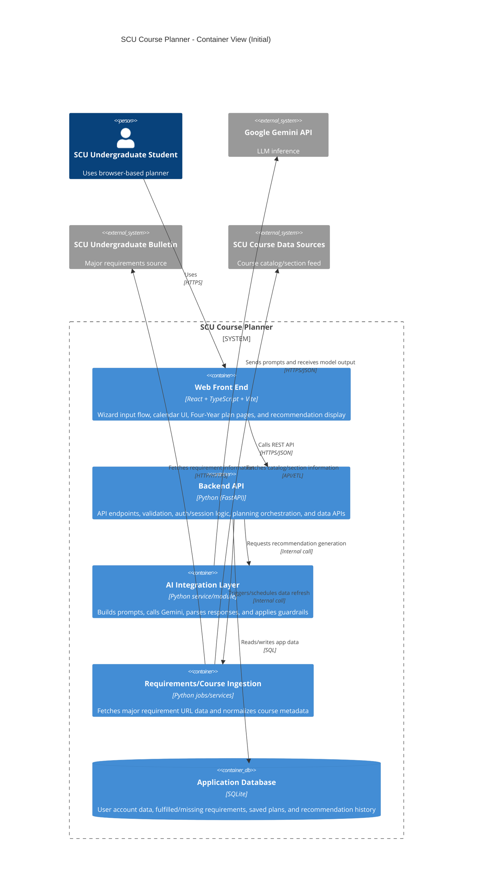
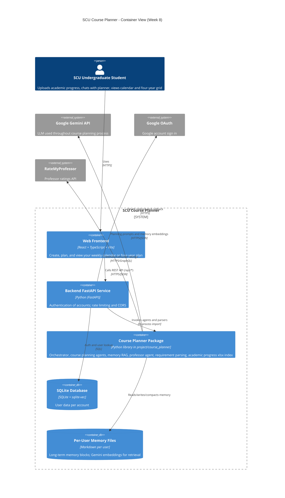
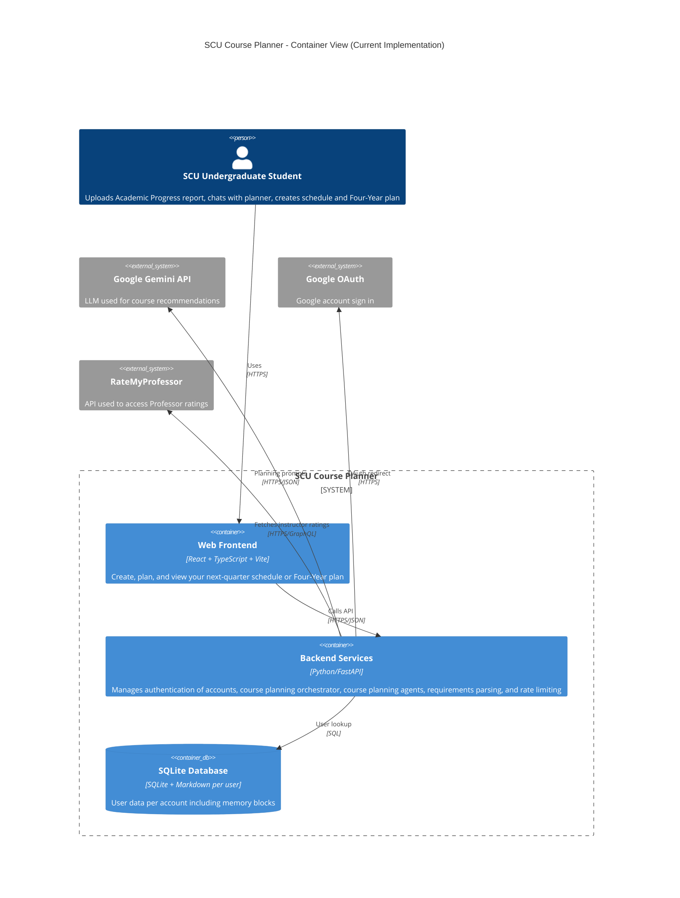

# Team SCU Course Planner · Jason · Ismael · Joey · Jiasheng 
---
# Product Vision

Our vision for SCU Course Planner was to create a tool to help students during the tedious part of the course selection process, where they have to navigate many different competing sources of information to find the right courses for them. This product vision generally stayed the same throughout the course of the project.

One major item that got cut from our initial product vision was Workday automation. Since our product vision was to provide SCU students with ease and convenience, we wanted them to be able to automatically import their academic progress using their existing Workday account. Given the time constraints and security concerns, we had to remove this from our vision and instead let students manually import instead. This slightly went against our initial product vision, however it was technically necessary to create a more secure product.

Our full project vision can be found [Here](https://github.com/CSEN-SCU/csen-174-s26-team-project-course-planner/blob/main/product-vision.md).

# Architecture Evolution

## [Initial C4 Container Diagram](https://github.com/CSEN-SCU/csen-174-s26-team-project-course-planner/blob/main/architecture/architecture.md)

This was the initial C4 container diagram we created before beginning the project.

## [Week 8 C4 Container Diagram](https://github.com/CSEN-SCU/csen-174-s26-team-project-course-planner/blob/main/architecture/architecture-retrospective.md):

The main differences between the Week 4 and Week 8 C4 container diagrams we wanted to highlight were the different outside resources that our project accesses. Initially, we planned integrations with APIs from SCU, such as Workday, to ensure easy and automated access to all of the necessary data. However, while working on the project we found that there was no easy and secure way to access this data through an API, so we instead let students manually upload their Academic Progress Report instead. This caused us to remove SCU Course Data Sources and SCU Undergraduate Bulletin.

[This commit](https://github.com/CSEN-SCU/csen-174-s26-team-project-course-planner/commit/c0953214c3a531e39b3f5c59fc3b3f5425bfc165) highlights when we removed the Workday integration.

[This commit](https://github.com/CSEN-SCU/csen-174-s26-team-project-course-planner/commit/43800d547db0efd778fa7156b20b310ff9fdbf96) highlights when we implemented the RateMyProfessor API.

We also added Google OAuth because we found that relying on them for accounts was more likely to be secure than something we would create ourselves. Lastly, we also included RateMyProfessor because we found out during this time that they offered an API that provided professor ratings that we did not have a source for before.

[This commit](https://github.com/CSEN-SCU/csen-174-s26-team-project-course-planner/commit/f27fe3b267deacc40d55f3933fcd179e292dc818) highlights when we removed the old login system.

## Final C4 Container Diagram

Between Week 8 and our final code freeze, no significant technical components changed in our project. The differences visible between the two diagrams are to make it more understandable and readable.

# Current Prototype

Currently, our SCU Course Planner prototype offers the basic functionality that we envisioned in our initial [Product Vision](https://github.com/CSEN-SCU/csen-174-s26-team-project-course-planner/blob/main/product-vision.md), including automated course recommendations, Four-Year plan advice, and an easy-to-use interface to help students plan their coursework easily and quickly. SCU Course Planner also has some notable limitations, including the need to manually upload academic progress, at times unreliable AI recommendations, and other design limitations. However, overall we believe that our project demonstrates the feasibility of our idea.

## Demo Links

View a live demo of SCU Course Planner [Here](https://csen-174-s26-team-project-course-planner.onrender.com/).

Watch a demo video of SCU Course Planner [Here](https://youtu.be/tVj_4x3yKEU).

Demo Night tagged code can be viewed [Here](https://github.com/CSEN-SCU/csen-174-s26-team-project-course-planner/tree/demo-night).

## Implemented Features

### Automated Course Recommendations

The primary differentiating feature we focused on in SCU Course Planner was the automated AI course recommendation system (Found in [project/course_planner](https://github.com/CSEN-SCU/csen-174-s26-team-project-course-planner/tree/main/project/course_planner)).

### Four-Year Planning

Another differentiating feature we added was automated AI recommended Four-Year plans (Found in [project/course_planner](https://github.com/CSEN-SCU/csen-174-s26-team-project-course-planner/tree/main/project/course_planner)).

### Easy-to-Use Interface

One feature we spent a significant amount of time considering and polishing was the frontend user interface to ensure a consistent and understandable experience (Found in [project/web](https://github.com/CSEN-SCU/csen-174-s26-team-project-course-planner/tree/main/project/web)).

# Engineering Process: Testing, Security, Deployment

## Testing 

### What we Chose to Test

For testing, we chose to test individual components of subsystems and work our way out to larger systems. We especially wanted to make sure that each step of the course recommendation system functioned to create a working system. This was primarily accomplished using our [Test Driven Development skill](https://github.com/CSEN-SCU/csen-174-s26-team-project-course-planner/blob/main/.cursor/skills/test-driven-development/SKILL.md) which ensured that after each prompt, a corresponding test was generated. One aspect we made sure to test was the accessibility of our frontend.

### Why

For general testing, we wanted to make sure that our code was as reliable and functional as possible. This should reduce code debt in the long term and make development generally easier as complexity increases.

For course recommendations, we tested it specifically to ensure that the core functionality of our project works accurately and reliably at each step of the way. If this feature didn't work well, there would be fundamentally no reason to use our product.

For accessibility, we wanted to make the product usable by any SCU student, including those who use assistive technologies like screen readers.

### What we Chose not to Test

We did not run live Gemini API calls due to concerns over cost and its nondeterministic nature. Instead, we stubbed the model and asserted post-processing instead. We did not run a full automated accessibility sweep of every page because we only targeted accessibility checks on high-traffic controls that could be logically checked with a test.

### Planned Tests

We began with creating Red tests based on each team member's ownership, as laid out [Here](https://github.com/CSEN-SCU/csen-174-s26-team-project-course-planner/blob/main/architecture/architecture.md). These tests were created before the features were implemented, so they were expected to fail. After that, we planned to continuously implement new tests using our TDD skill automatically for each change and as needed manually.

### Implemented Tests

We implemented over 600 Python pytest backend tests and 60 Vitest frontend tests. Our CI pipeline ran all of these tests on every commit and PR. Below are two examples of such tests:

[test_major_requirements.py](https://github.com/CSEN-SCU/csen-174-s26-team-project-course-planner/blob/main/project/tests/test_major_requirements.py):

This test ensures that the parsed major requirements make logical sense. This was done by ensuring that, for the Computer Science & Engineering major, completed courses such as CSEN 10 and ENGR 1 do not appear in the remaining requirements.

[iy_plannernav_accessibility.test.tsx](https://github.com/CSEN-SCU/csen-174-s26-team-project-course-planner/blob/main/project/tests/ismael/iy_plannernav_accessibility.test.tsx):

This test ensures that the active tab of our frontend properly functions with screen readers in mind.

### AI vs Human Judgment

We generally used our AI tools heavily when creating the specific test cases, especially using the TDD skill mentioned earlier. This helped ensure better functionality of our code over time, but wasn't perfect. There were multiple instances where a commit would fail our tests, despite instructions to not do so. In these cases we had to go through the test log and correct whatever issue caused it.

## Security

### Planned Security Fixes

Our peer Red-Team found a few potential problems with our project including prompt injection, rate limiting, and data privacy (Found [Here](https://github.com/CSEN-SCU/csen-174-s26-team-project-course-planner/blob/main/docs/red-team-report-team-Email-Triage-Agent.md)).

### Implemented Security Fixes

We took our Red-Team feedback into account and addressed their security concerns. Below are two examples of security fixes we made to our project:

For prompt injection, we added more safeguards in our system prompt to label user content as untrusted and add more explicit instructions. This can be found in [PR 28](https://github.com/CSEN-SCU/csen-174-s26-team-project-course-planner/pull/28).

For data privacy concerns, we added a Data Disclosure page in [PR 27](https://github.com/CSEN-SCU/csen-174-s26-team-project-course-planner/pull/27). This page explicitly stated how we process user data so that they can make an informed decision before uploading their Academic Progress Report.

### AI vs Human Judgment

Generally, we used our own judgment when making the determination of how we wanted to address our issues and used AI tools to implement them. For the Data Disclosure page, we wrote the content ourselves to make it clear and understandable. For implementing the other security concerns, we generally used AI tools to implement the technical security fixes based on our own ideas.

## Deployment

### Planned Deployment

Our plan was to use GitHub Actions for our CI Pipeline and CD using Render. This would allow us to automatically publish any correct changes to the website.

### Implemented Deployment

Every PR or push to main runs the entire test suite mentioned previously using GitHub Actions. If it passes, it is then automatically deployed to Render. This allowed us to quickly iterate and test our project.

### AI vs Human Judgment

We decided on our CD pipeline using Render. We used some AI tools in the process of setting it up, but generally this was a more manual process that couldn't be automated, including creating the Render account, setting up our secrets, and ensuring everything functioned as we expected. Once we set it up initially, it worked well throughout the project.

## What changed when AI was in the loop

For testing, security, and deployment, the AI tools we used allowed us to quickly iterate based on our own findings. This was especially true in testing, where we had them write the vast majority of our test cases using the TDD skill without the need for manual intervention. However, the important testing, security, and deployment decisions were still made by us. We decided to use Render for deployment, we decided that we wanted to add a Data Disclosure page, and we decided how to address failing test cases.

Generally, the AI tools we used automated the implementation work while we still made the important decisions ourselves.

# Successes, Setbacks, and what we would Change

## Notable Successes

1. We built a clean and visually pleasing UI during which we kept and improved upon until the demo. This worked well during each sprint as everyone in the group was working on different sections which made it easy to update the UI without having any major merge conflicts. From this, our team would keep the practice of each person having an assigned section so that multiple people don’t work on the same thing at the same time.

2. After receiving the Red-Team feedback, we quickly implemented the fixes needed to make sure that our product was safe and secure. We implemented fixes to deal with prompt injection and added a data disclosure page for any data privacy concerns that users may have. 

3. Our course recommendation system successfully recommends viable courses to students while also being flexible with any changes the user wants. We found that many of its recommendations did align with our selections we made for next quarter.

## Notable Setbacks

1. We had issues with our initial implementation of the AI recommendation system. When we prompted our AI tools to design the system itself, its end result produced strange and often incorrect courses. We believe this is because the design the AI came up with and created was either incomplete or incorrect.
[This commit](https://github.com/CSEN-SCU/csen-174-s26-team-project-course-planner/commit/3fa24b4) and [this commit](https://github.com/CSEN-SCU/csen-174-s26-team-project-course-planner/commit/3c54570) were both instances of us attempting to fix the course recommendations by simply prompting the AI to fix it and still failing.

What we missed early on was that passing off too much design work to the AI tools can lead to poor results as they try to fill in the blanks. We did ultimately correct this issue by scrapping the existing solutions and we attempted to design our own system ourselves. We then prompted our AI tool with this design, which it was successfully able to implement.

2. We had multiple issues where deleting dead code we would inadvertently cause the CI to fail because that code was relied on by several tests. We also had issues where, when prompted by an AI tool to delete code, it would create a new test checking for certain functionality not being there. Both of these issues showed that the TDD skill we used at times did not work well when removing dead code. [This commit](https://github.com/CSEN-SCU/csen-174-s26-team-project-course-planner/commit/6efc1e4) is one example of this problem. 

We missed this problem early on because we only began to remove dead code much later in the project. This is something we should consider in future work and might justify changing TDD skills to one without this problem.

## AI Tool Reflections

Throughout the quarter, AI tools we used were good at drafting any feature we prompted for. This helped us rapidly prototype what we wanted from our project, however many of the outputs had problems that either needed to be corrected by AI tools or manually ourselves.

There were many smaller issues we had with the output of AI tools in the project. The UI aspects were quickly created but often had bugs or small inconsistencies that needed to be fixed. The AI summaries used by some group members for their commits were hard to understand and sounded very generic. There were also moments when AI changes broke our test cases despite our skill explicitly instructing it to avoid this. The text it wrote for frontend UI elements similarly sounded generic and had to be rewritten manually by us.

We also ran into some issues using the AI API that our project relied on. One major problem was the Gemini API giving bad or incorrect results for the Four-Year recommendations. We had many strange behaviors occur, such as recommending that a student take up to seven years of courses, even though they weren't behind. It had problems with the amount of units being offered ranging from 2 to over 20 units a quarter, the amount of quarters being considered, often going into 5+ years, and other things with four-year planning. Since these tools are fundamentally nondeterministic and very complex, it can be hard to tell exactly what the problem is consistently. If we had used a higher tiered version of the Gemini API, it is possible the problems would have been easier to fix at the cost of each prompt being more expensive.

Overall, the AI tools we used for this project were good at creating drafts of features, however they still require a lot of human oversight and intervention to create a well-designed product. You cannot simply tell an AI to make a full project and rely on that output.

# Future Work

1. We would like to implement better scaffolding for four-year planning to better accommodate the needs of students from all majors and to better follow the recommended SCU schedules. Currently some details are not included, such as typical course offerings in future terms. 

- Importance: It is crucial that students trust our Four-Year plan feature, so it must consistently produce correct and logical data.

- Effort: We estimate that we would need at most one additional sprint to fix this problem.

2. There are many edge cases that our product does not consider, such as study abroad, minors, or double majors. For the scope of this term, we kept SCU Course Planner to just major requirements, but in future work we would like to add these edge cases to its consideration.

- Importance: A large share of students have at least one of these situations, and for them an inaccurate plan is worse than no plan.

- Effort: We estimate this would take much longer than one sprint, because it would require significant redesigns to the fundamental design of our project.

 
3. Adding Workday integration from our original product vision is a major feature we would like to add to the product in the future. It would streamline the entire process of uploading data and provide the students with real-time class availability and remove the hassle and confusion of uploading your academic progress. Additionally, it would automate the program so it automatically gets the course offerings for each quarter, and if they change, it would reflect that as well. Finally, it would allow the program to be a one-stop shop for registration, allowing students to find classes, create schedules, and register all from our webpage. 

- Importance: Better usability and reliability since all information is always accurate and up to date. 

- Effort: We would need to work with Workday SCU and get their approval of it, which would be very difficult especially from the security perspective. We estimate this would take a few months to coordinate.

4. Once the product is polished and completed, branching out to other schools was a suggestion we got from one of the judges on demo night. We really liked this idea since once we implement Workday’s API, it would be as easy as switching Workday to another school’s system. This way we would expand our user base and potentially make some money off of it. 

- Importance: Expanding this tool to other universities is the ultimate stress test for scalability. It forces us to transition from a student proof-of-concept to a production-ready application.

- Effort: This would be a challenge beyond the scope of software engineering and would likely run parallel to development. It would turn into more marketing and revising based on each school's feedback.

# Advice to Future Teams

1. Be flexible in your implementation, your ideas will change as you work on them.

2. Don’t be afraid of breaking things, you can always roll back your project history if things go wrong.

3. Consider the user experience and interface of your project, not just the technical details.
