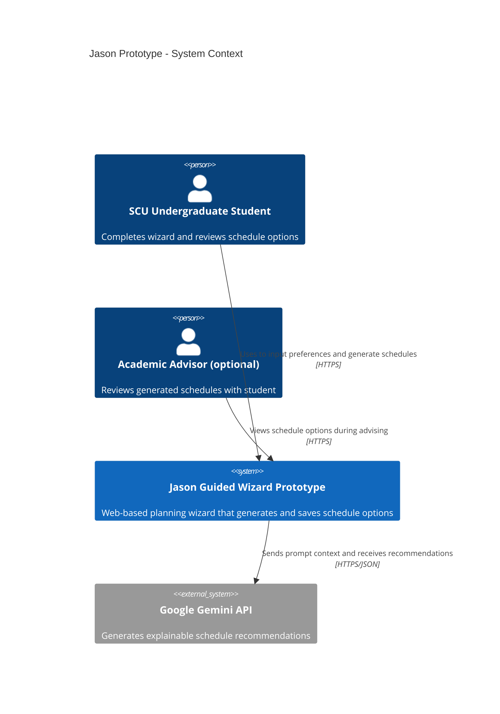
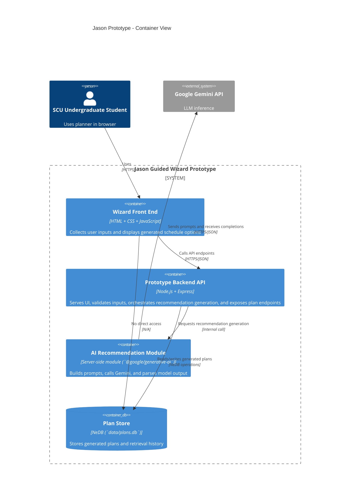

# Jason Prototype - C4 Architecture

This document describes the architecture for Jason's prototype only (guided wizard planner).

## Design Focus

- Prioritized a guided wizard flow to collect student context and constraints before recommendation generation.
- Kept backend and persistence lightweight (`Express` + `NeDB`) to move quickly for prototype validation.
- Integrated Gemini through the backend (not the browser) so API keys remain server-side.
- Included fallback seeded schedules when Gemini is not configured, so the demo is still usable.

## C4 Context Diagram

## C4 Container Diagram

